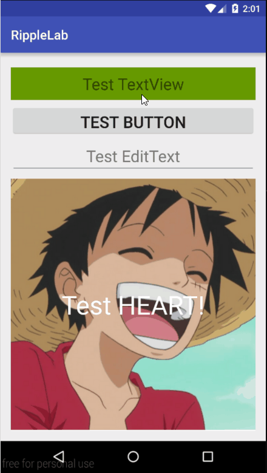

#RippleCompat
----

You can choose two type of ripple: Circle and Heart!

##Demo

##Drawbacks

- It would ignore the `scaleType` of `ImageView`;
- It would disable the `OnTouchListener` of the setted view. (click listener would be triggered as normal)
- Some widget (Button, EditText, etc. ) only perfrom correctly in **AppCompat style widget**. 
- many many..

##How to use?

Init library in your `Activity`:
        
        
    RippleCompat.init(context);

Use below code for each view you want to ripple:

    RippleCompat.apply(view);

or more customization:

    RippleConfig config = new RippleConfig();
    config.setBackgroundColor(backrgoundColor);
    config.setIsFull(isFull);
    config.setFadeDuration(duration);
    config.setRippleDuration(rduration);
    config.setInterpolator(interpolator);
    config.setRippleColor(rippleColor);
    config.setType(RippleCompatDrawable.Type.HEART);
    
    RippleCompat.apply(view, config);

##Dependency

v7 support library.